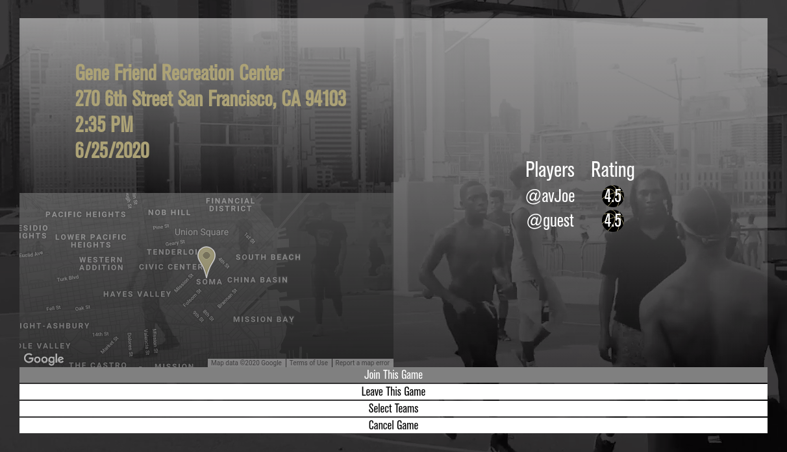
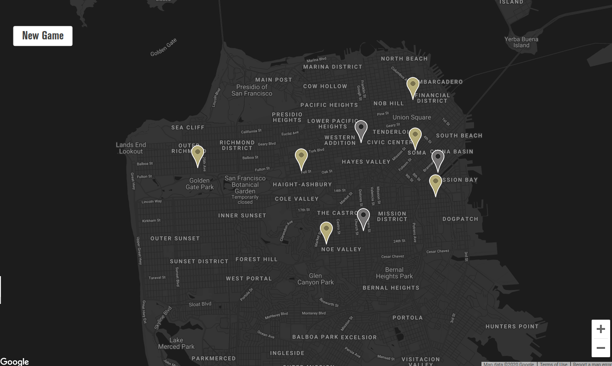

# Ball UP
## An app for basketball players to connect, form teams and meet up to play pick-up games.

[Live Site](https://ballup-sf.herokuapp.com/#/)


### Background
Ball Up is a website for basketball players and enthusists. With this website users can create a new game and location that other players can view and join. After playing with a game, individuals can give star ratings (1 - 5) to eachother based on general conduct on the court and style of the player.

### Functionality 
* Sign up and Login for users
* Create a new game and location
* Join a game
* Split the players into two teams with assigned positions
* Give individual players an optional rating

### Architecture and Technologies
This project will be implemented with the following technologies:

- `JavaScript`
- `MongoDB`  
- `Mongoose.js`  
- `React.js`  
- `Redux`  
- `Node.js`  
- `Express.js`  
- `Google Maps API` 

### Future Implementations
There are additional features that I would like to implement for Ball UP.
- [ ] Allow players to choose which team they want to join.
- [ ] Add comments to each game.
- [ ] Player profiles.

### Ball UP Snippets

#### Adds a new player to a game


Checks if the player has already been added to the player list and adds the player, then displays a new list of players
````js
    addPlayer(e) {
        e.preventDefault();
        
        let exists = false;

        this.state.game.players.forEach( player => {
            if (player.id === this.props.player.id || 
                player._id === this.props.player.id) {
                    exists = true;
                }
        })
        if (exists === false){
         this.state.game.players.push(this.props.player);
         this.props.updateGame(this.state.game);
        }
    }
````

#### Displaying locations on a map


Passes an address to a Geocoding API that returns a longitude and latitude in the response that is then placed into the Google map and shown on the game show page.
````js
    setCoords(address) {
        
        let url = `https://maps.googleapis.com/maps/api/geocode/json?address=${address}&key=***********************`;

        fetch(url)
            .then((response) => {
                return response.json();
            })
            .then((data) => {
                
                this.state.lat = data.results[0].geometry.location.lat;
                this.state.lng = data.results[0].geometry.location.lng;
                
                this.setState({ lat: this.state.lat });
                this.setState({ lng: this.state.lng });

            });
    }
````
